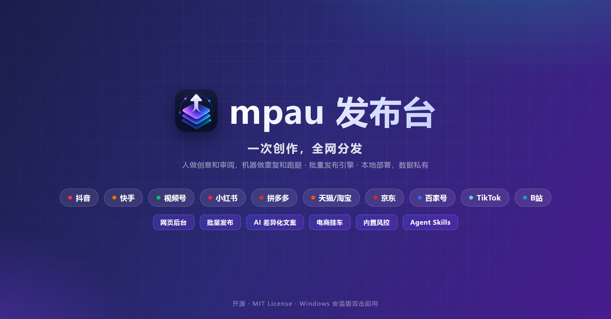
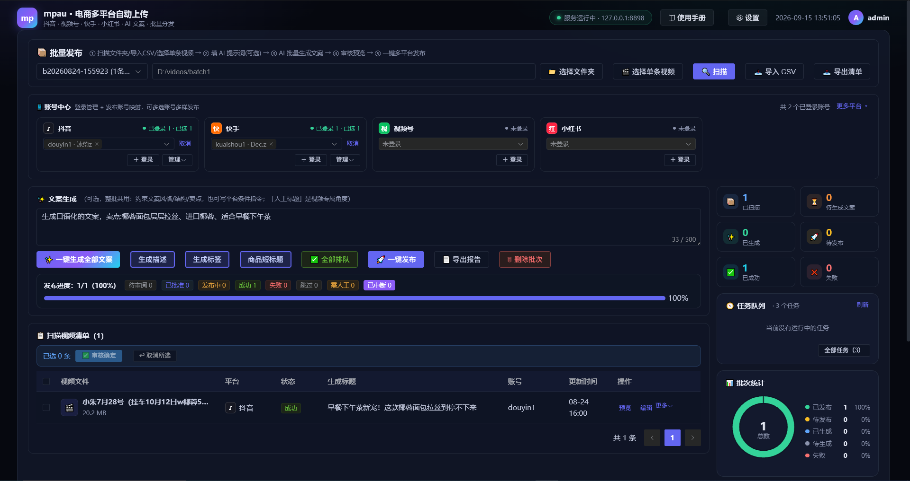
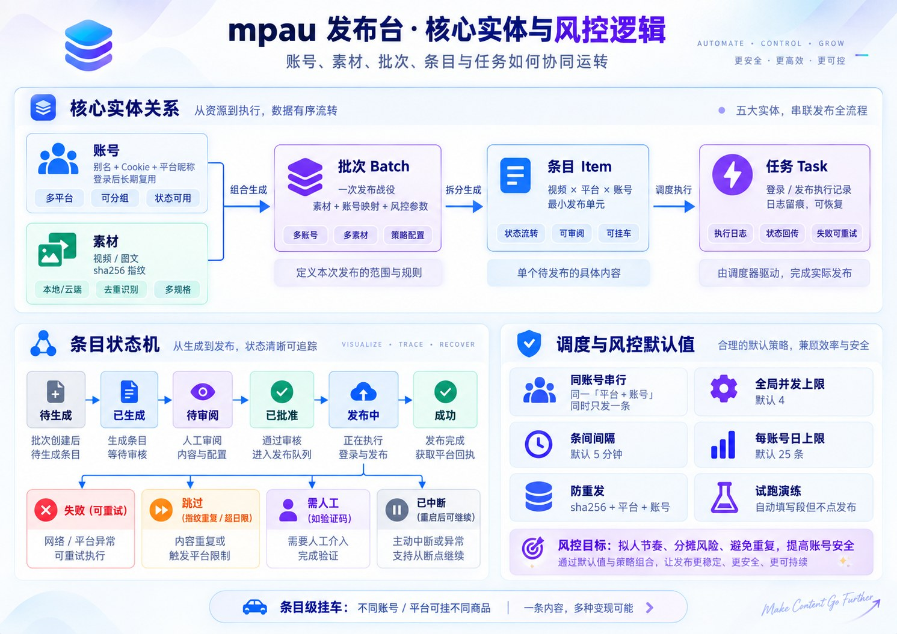
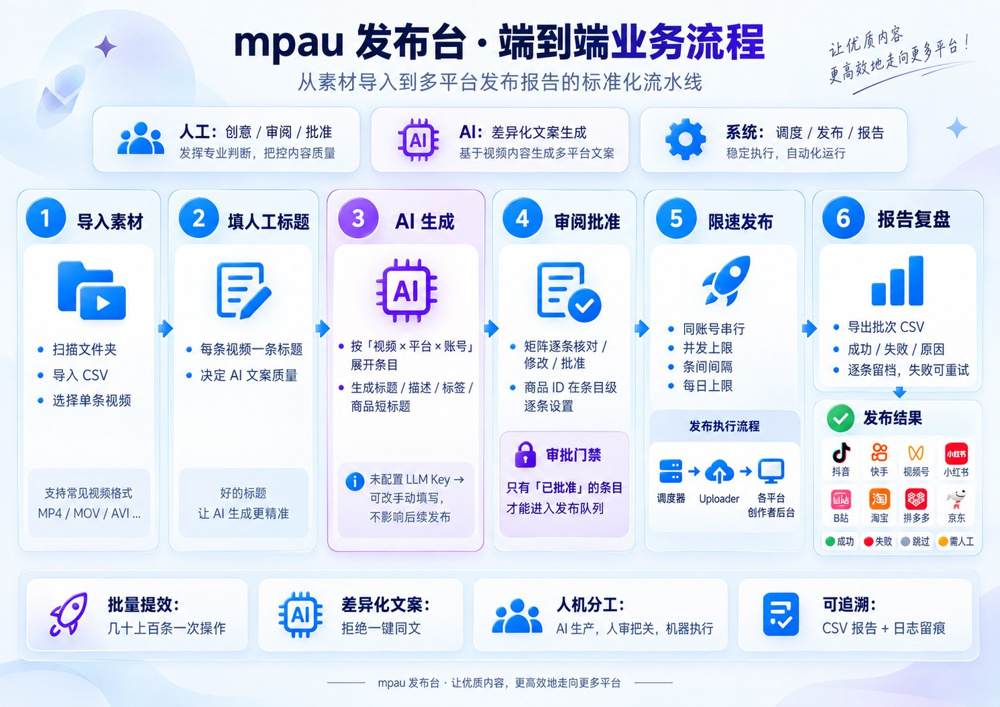
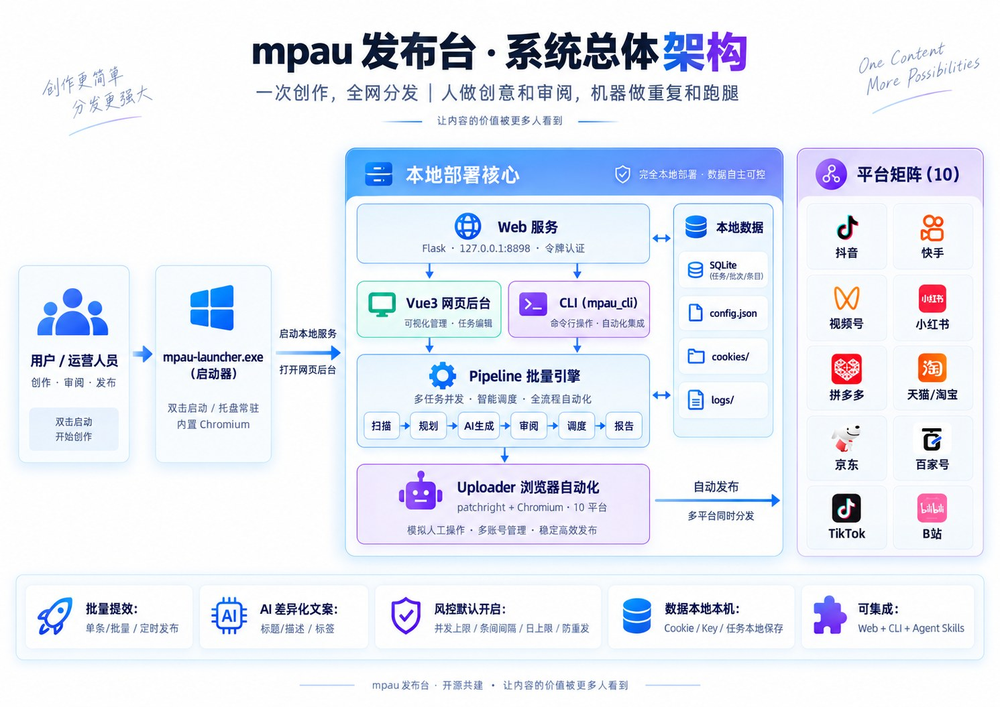

# mpau 发布台 · 多平台自动发布系统

<p align="center">
  
</p>

<p align="center">
  <b>一次创作，全网分发。</b>视频、图文、定时发布与挂商品，覆盖 10+ 主流社交与电商平台。
</p>

<p align="center">
  <a href="LICENSE"></a>
  
  
  
  
</p>

> [!NOTE]
> 本项目基于 [cjccd/multi-platform-auto-upload](https://github.com/cjccd/multi-platform-auto-upload)（MIT License）二次开发，在其基础上新增了网页管理后台、批量发布引擎与 Windows 安装版打包。

---

## 这是什么

mpau 发布台是一个**开箱即用的多平台内容自动发布系统**：账号扫码登录一次，之后的单条与批量发布都由系统按平台规则自动完成。

- **给普通用户**：下载 exe 双击安装，桌面图标打开网页后台，图形界面完成全部操作；
- **给开发者**：完整 CLI 与 Agent Skills，可被脚本、定时任务和外部 AI Agent 驱动。

<p align="center">
  <br/>
  <sub>批量发布工作台：账号中心（多账号 + 真实昵称）· AI 文案引擎 · 审阅清单 · 任务队列 · 批次统计</sub>
</p>

---

## 功能特性

| 能力 | 说明 |
| --- | --- |
| 🖥️ 网页管理后台 | 安装版双击即用，内置 Chromium 浏览器独立窗口打开，与系统默认浏览器无关；关闭窗口后托盘常驻，右键退出 |
| 📦 批量发布引擎 | 导入（扫文件夹 / CSV / 单条）→ 填标题 → AI 生成 → 矩阵审阅 → 批准 → 限速发布 → 导出报告，全程留痕 |
| ✨ AI 差异化文案 | 一条人工标题，按各平台风格与字数限制生成差异化文案，候选切换、单条重生成、合规校验；接入任意 OpenAI 兼容接口（推荐 DeepSeek） |
| 👥 多账号矩阵 | 同平台多账号逐个勾选或一键全选/取消；登录后自动抓取并显示平台真实昵称 |
| 🛒 电商挂车 | 抖音挂商品链接；视频号/拼多多/天猫/京东挂商品 ID；快手按商品名称挂小店；商品 ID 逐条设置、只作用于本条 |
| 🛡️ 内置风控 | 同平台同账号串行、并发上限（默认 4）、条间间隔（默认 5 分钟）、每账号日上限（默认 25）、视频指纹防重发、试跑演练 |
| 🔒 数据本地私有 | Cookie、任务数据、LLM Key 全部保存在本机，不上传任何云端；后台默认仅本机访问并启用令牌认证 |
| 🧩 Agent Skills | `skills/` 目录内置各平台技能文档，外部 AI Agent 读取后调用 CLI 完成发布（系统本身不含对话界面） |

---

## 支持平台

| 平台 | 类别 | 视频 | 图文 | 定时 | 挂商品 | 试跑 | 标题限制 |
| --- | --- | --- | --- | --- | --- | --- | --- |
| 抖音 douyin | 社交+电商 | ✓ | ✓ | ✓ | 商品链接 | ✓ | ≤ 55 字 |
| 视频号 tencent | 电商 | ✓ | — | ✓ | 微信小店 / 橱窗商品 ID | 存草稿 | 短标题 ≤ 16 字 |
| 拼多多 pdd | 电商 | ✓ | — | ✓ | 拼多多商品 ID | ✓ | — |
| 天猫/淘宝 tmall | 电商 | ✓ | — | ✓ | 淘宝 / 天猫商品 ID | ✓ | ≤ 30 字 |
| 京东逛 jd | 电商 | ✓ | — | ✓ | 京东商品 ID | ✓ | 5 – 27 字 |
| 快手 kuaishou | 社交 | ✓ | ✓ | ✓ | 商品名称 | — | ≤ 55 字 |
| 小红书 xiaohongshu | 社交 | ✓ | ✓ | ✓ | — | — | ≤ 20 字 |
| B 站 bilibili | 视频 | ✓ | — | ✓ | — | — | — |
| 百家号 baijiahao | 内容 | ✓ | — | ✓ | — | — | — |
| TikTok tiktok | 视频 | ✓ | — | ✓ | — | — | 仅标题 + 话题 |

---

## 核心实体与风控逻辑

账号、素材、批次、条目（视频 × 平台 × 账号）、任务如何协同运转，以及系统默认开启的风控策略：

<p align="center">
  
</p>

---

## 快速开始

### 方式一：安装版（推荐，免环境）

1. 到 [**Releases**](https://github.com/zhu8602/mpau/releases) 下载最新的 `mpau-setup-<版本>.exe`；
2. 双击安装（免管理员，Python 运行时与浏览器内核已内置）；
3. 双击桌面「mpau 发布台」图标——系统自动拉起后台并用内置浏览器打开管理界面。

> 关闭窗口后系统在桌面右下角托盘继续待命，右键托盘图标可「打开主界面 / 退出」；覆盖安装不会丢失账号与批次数据（数据目录独立：`%LOCALAPPDATA%\mpau-data`）。

### 方式二：源码版（开发 / CLI / Agent 集成）

```bash
git clone https://github.com/zhu8602/mpau.git
cd mpau

uv venv && .venv\Scripts\activate
uv pip install -e .
python -m patchright install chromium
mpau --help          # 验证安装

# 启动网页后台
uv run --extra web python web/app.py
```

环境要求：Python 3.10–3.12、[uv](https://docs.astral.sh/uv/)。

---

## 七步发出第一条内容

<p align="center">
  
</p>

1. **启动后台**：安装版双击桌面图标（源码版运行 `web/app.py` 后打开带 token 的链接）
2. **扫码登录**：选平台 → 输入账号昵称 → 手机 App 扫码确认，长期免登
3. **配置 AI 文案引擎**（用 AI 前必做）：设置 → 填 LLM 接口地址 / API Key / 模型名（推荐 DeepSeek）；不配也能用发布等其余功能
4. **导入素材**：「选择文件夹」扫描整批视频，或「导入 CSV」，或选单条视频
5. **AI 生成 + 审阅**：一键生成各平台差异化文案，矩阵审阅逐条批准
6. **试跑演练**（抖音 / 拼多多 / 天猫 / 京东）：自动填好全部字段但不点发布，现场核对
7. **正式发布**：任务队列实时跟踪进度与日志，失败可定位重试，支持导出报告

---

## 命令行 CLI（源码版）

统一结构：`mpau <平台> <动作> [参数]`，网页后台的全部能力 CLI 均可完成。

```bash
mpau douyin login --account shop1 --headed          # 扫码登录
mpau douyin check --account shop1                    # 检查登录态
mpau jd upload-video --account shop1 --file ./demo.mp4 \
  --title "真实测评" --goods-id "10204078771126" --headed   # 挂商品 ID 发布

# 批量发布（与网页后台共用同一引擎）
mpau batch scan --dir D:\videos\0618
mpau batch plan --batch-id <id> --platforms douyin,kuaishou
mpau batch generate --batch-id <id>
mpau batch approve --batch-id <id>
mpau batch run --batch-id <id> --interval-min 5
mpau batch report --batch-id <id>
```

平台：`douyin | tencent | pdd | tmall | jd | kuaishou | xiaohongshu | bilibili | baijiahao | tiktok`
动作：`login | check | upload-video | upload-note | verify | nickname`

---

## AI Agent 集成

`skills/` 目录内置各平台技能文档（SKILL.md）。外部 AI Agent（Kimi Code、Claude Code 等）可以：

1. 读取对应平台的 `SKILL.md`
2. 调用 `mpau check` 确认登录态
3. 调用 `mpau upload-video` / `upload-note` 完成发布
4. 读取日志，汇报成功、失败或需要人工介入的环节

详见 [Agent 集成文档](docs/agent-integration.md)。系统本身不含对话界面，Agent 能力以源码版提供。

---

## 系统架构

本地部署核心：启动器拉起 Web 服务，网页后台与 CLI 共用批量引擎，经 patchright 浏览器自动化分发到 10 个平台；数据全部留在本机。

<p align="center">
  
</p>

## 项目结构

```text
mpau/
├── mpau_cli.py        # CLI 入口
├── web/               # 网页管理后台(Flask + Vue3)
├── pipeline/          # 批量发布引擎(调度/审阅/风控/报告)
├── uploader/          # 各平台上传器(patchright 浏览器自动化)
├── skills/            # Agent Skills(供外部 AI Agent)
├── tools/             # 安装包构建(Inno Setup)/ 启动器 / 图标管线
├── package/           # 打包产物与安装脚本
├── utils/             # 共享工具
├── docs/              # 使用手册 / 集成与开发文档
└── tests/             # pytest 测试(160+)
```

## 文档

- [使用手册（完整图文版）](docs/使用手册.html) — 系统内「使用手册」按钮直达
- [安装说明](docs/installation.md) · [开发文档](docs/development.md)
- [Agent 集成](docs/agent-integration.md) · [视频分析](docs/video-analysis.md)

## 运行测试

```bash
.venv/Scripts/python.exe -m pytest tests/ -q
```

---

## 数据与安全

- 账号 Cookie、LLM API Key、访问令牌均以明文保存在**本机数据目录**（安装版 `%LOCALAPPDATA%\mpau-data`，源码版为项目根目录），请妥善保管，勿将这些目录外发；
- 网页后台默认仅监听 `127.0.0.1` 并启用令牌认证；局域网模式也需持令牌访问，**严禁暴露公网**；
- 本系统通过浏览器自动化模拟人工操作，无法保证完全规避平台风控，请遵守各平台规则合理使用。

## License 与免责声明

[MIT License](LICENSE)。原项目版权声明保留于 LICENSE 文件（Copyright (c) 2026 cjccd）。

本系统面向内容创作、自有账号运营与合法的自动化工作流。使用者必须遵守《中华人民共和国广告法》及各平台社区规范、用户协议，不得利用本系统发布违法、有害、侵权、虚假或骚扰性内容。因使用者违规使用导致的一切后果由使用者自行承担；本系统按「现状」提供，不附带任何担保。
